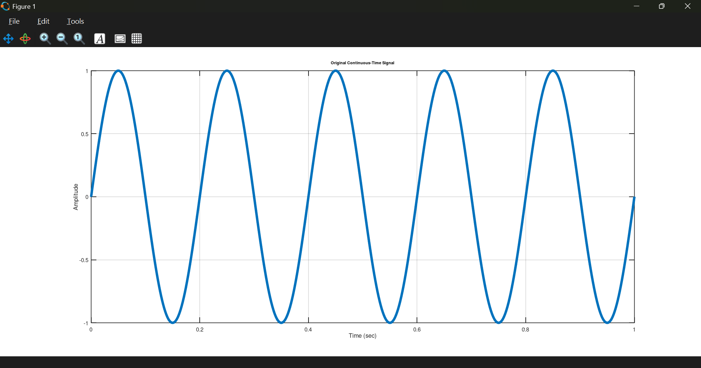
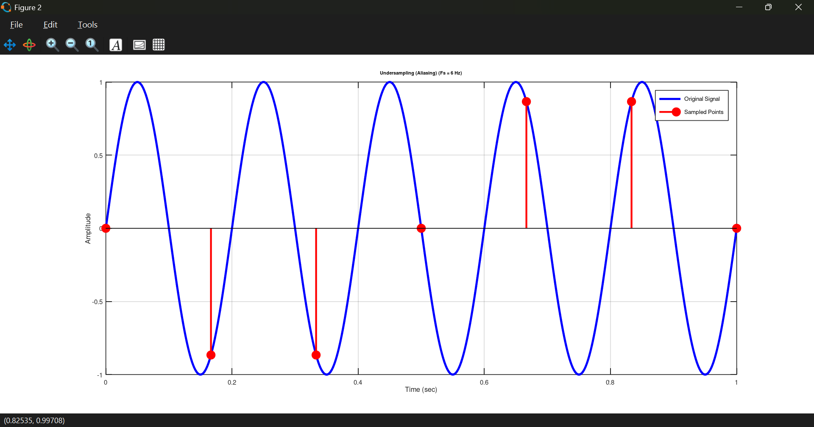
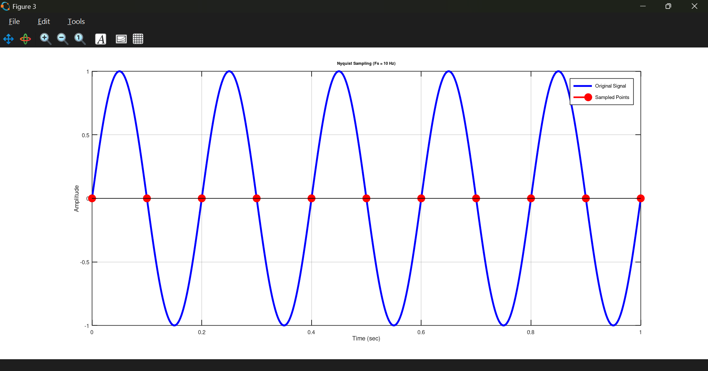
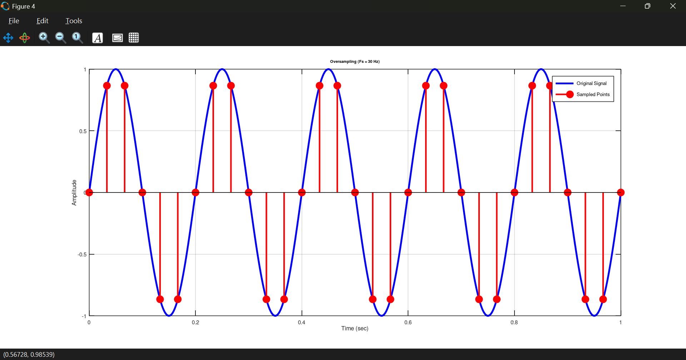
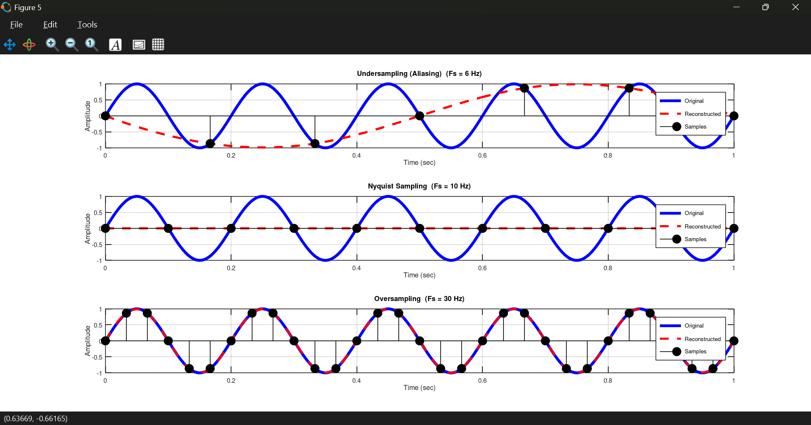
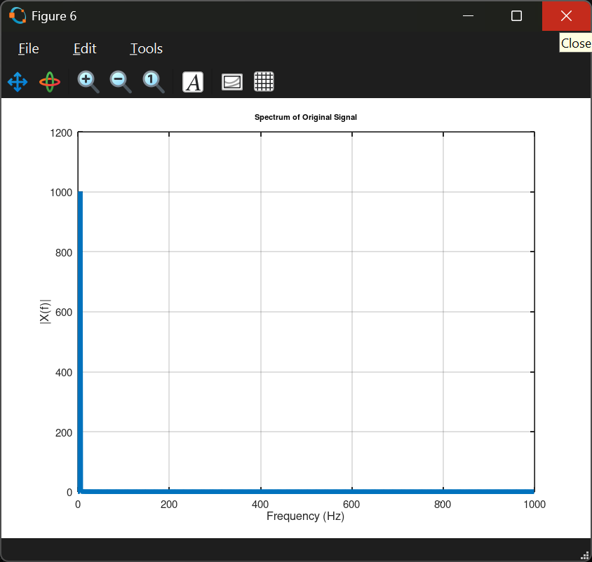
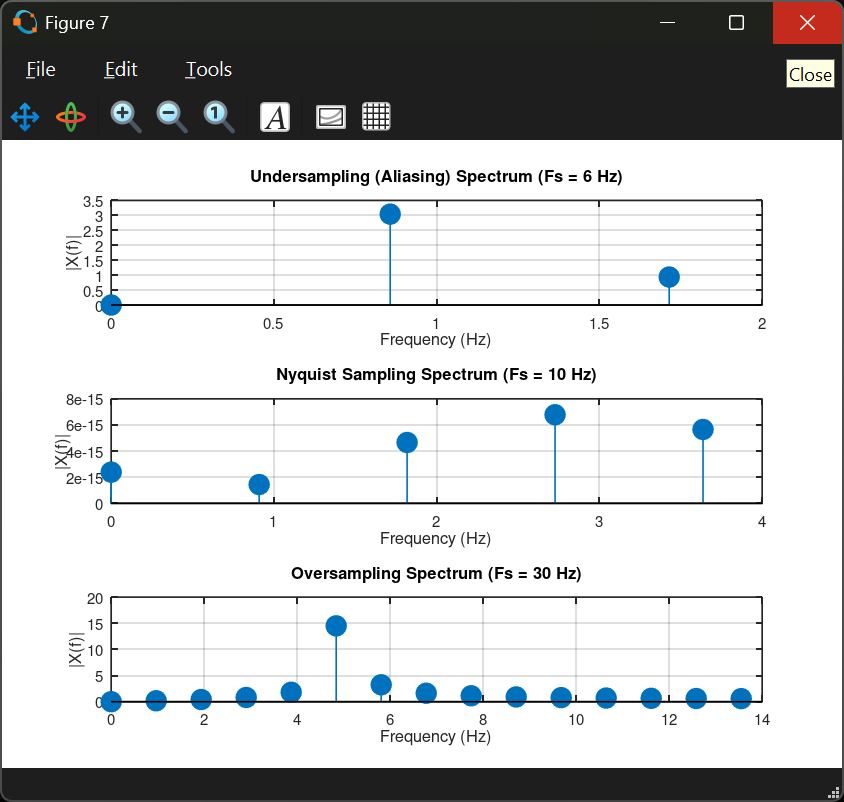
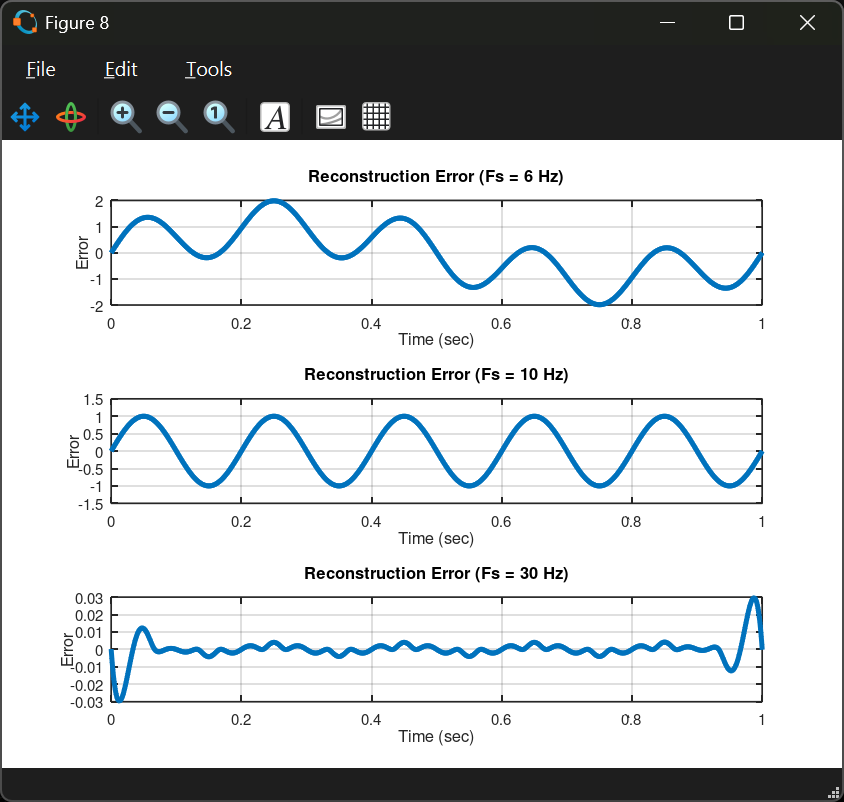
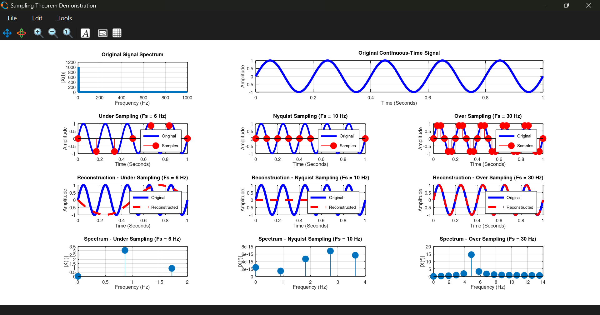

# 📡 Sampling Theorem Demonstration using GNU Octave

A GNU Octave implementation demonstrating the **Sampling Theorem (Nyquist-Shannon Sampling Theorem)** through graphical simulation. This project illustrates the effects of **undersampling**, **sampling at the Nyquist rate**, and **oversampling**, along with signal reconstruction and frequency spectrum analysis.

---

## 📖 Overview

The Sampling Theorem states that a continuous-time signal can be perfectly reconstructed from its samples if the sampling frequency is **at least twice the highest frequency component** present in the signal.

[
F_s \ge 2F_{max}
]

where:

* **(F_s)** = Sampling Frequency
* **(F_{max})** = Highest Frequency Component of the Signal

This project visualizes how different sampling frequencies affect the quality of signal reconstruction.

---

# ✨ Features

* Demonstrates the Nyquist Sampling Theorem
* Continuous-time sinusoidal signal generation
* Three sampling scenarios:

  * Under Sampling (Aliasing)
  * Nyquist Sampling
  * Over Sampling
* Signal reconstruction using spline interpolation
* Frequency spectrum analysis using FFT
* Single-window subplot visualization
* Well-commented GNU Octave code suitable for laboratory demonstrations

---

# 📂 Project Structure

```text
Sampling Theorem
│
├── sampling_theorem_demonstration.m    # Main demonstration
├── sampling_beta.m                     # Experimental version
│
└── assets
    ├── fig1.png
    ├── fig2.png
    ├── fig3.png
    ├── fig4.png
    ├── fig5.png
    ├── fig6.png
    ├── fig7.png
    ├── fig8.png
    └── fig9.png
```

---

# 📊 Simulation Parameters

| Parameter        |      Value |
| ---------------- | ---------: |
| Signal Type      | Sinusoidal |
| Amplitude        |          1 |
| Signal Frequency |       5 Hz |
| Duration         |   1 second |
| Nyquist Rate     |      10 Hz |

---

# 📈 Sampling Cases

| Case             | Sampling Frequency | Description                              |
| ---------------- | -----------------: | ---------------------------------------- |
| Under Sampling   |               6 Hz | Aliasing occurs                          |
| Nyquist Sampling |              10 Hz | Minimum sampling rate for reconstruction |
| Over Sampling    |              30 Hz | High-quality reconstruction              |

---

# 🖼️ Simulation Results

## Original Continuous-Time Signal

<p align="center">

</p>

---

## Under Sampling (Aliasing)

<p align="center">

</p>

Sampling below the Nyquist rate results in **aliasing**, where the reconstructed signal no longer accurately represents the original waveform.

---

## Nyquist Sampling

<p align="center">

</p>

Sampling at exactly the Nyquist rate captures the minimum number of samples required for successful signal reconstruction.

---

## Over Sampling

<p align="center">

</p>

Oversampling produces a denser set of samples, allowing the reconstructed signal to closely match the original waveform.

---

## Signal Reconstruction

<p align="center">

</p>

Comparison between the original analog signal and the reconstructed signals obtained from the sampled data.

---

## Original Signal Spectrum

<p align="center">

</p>

Frequency-domain representation of the original continuous-time signal obtained using the Fast Fourier Transform (FFT).

---

## Sampled Signal Spectra

<p align="center">

</p>

FFT of the sampled signals illustrating how different sampling frequencies affect the spectral representation.

---

## Reconstruction Error

<p align="center">

</p>

Reconstruction error for each sampling case. Oversampling produces the smallest error, while undersampling introduces significant distortion.

---

## Combined Subplot Demonstration

<p align="center">

</p>

A comprehensive visualization containing all stages of the Sampling Theorem demonstration in a single figure.

---

# ▶️ Running the Project

Open GNU Octave and execute:

```octave
sampling_theorem_demonstration
```

or

```octave
run("sampling_theorem_demonstration.m")
```

---

# 🎓 Learning Outcomes

After running this project, users will understand:

* Continuous-time signal sampling
* Nyquist-Shannon Sampling Theorem
* Nyquist sampling rate
* Aliasing caused by undersampling
* Oversampling advantages
* Signal reconstruction
* FFT-based frequency spectrum analysis
* Practical visualization of digital signal processing concepts

---

# 🛠️ Requirements

* GNU Octave 6.0 or later

No additional toolboxes are required.

---

# 📚 References

1. A. V. Oppenheim and A. S. Willsky, *Signals and Systems*, 2nd Edition.
2. Simon Haykin and Barry Van Veen, *Signals and Systems*.
3. John G. Proakis and Dimitris G. Manolakis, *Digital Signal Processing: Principles, Algorithms, and Applications*.
4. Claude E. Shannon, "Communication in the Presence of Noise," *Proceedings of the IRE*, 1949.

---

# 📄 License

This project is released under the MIT License.

Feel free to use, modify, and share it for educational and research purposes.
