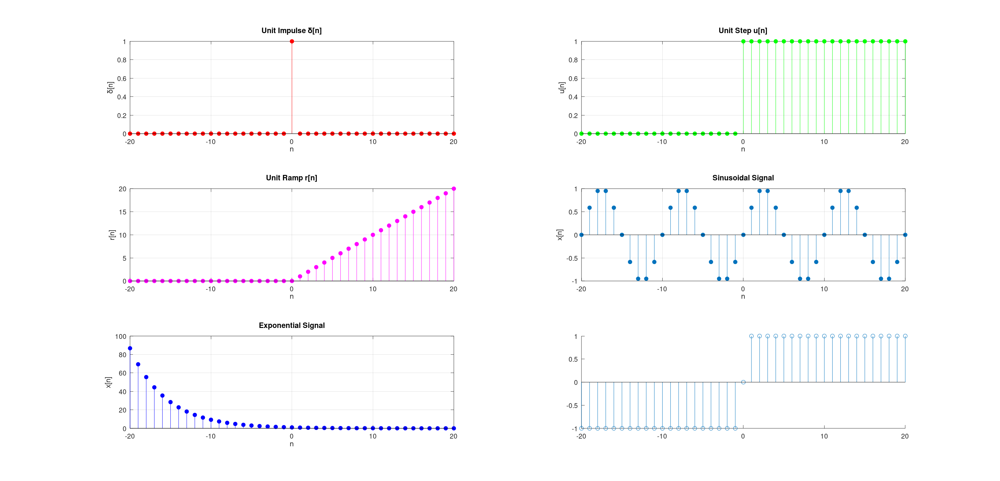
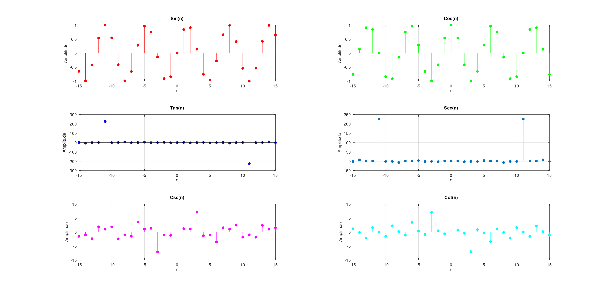

# Experiment 01 — Basic Discrete-Time Signals (DSP Lab)

## 1. Overview

This experiment covers the generation, classification, and visualization of fundamental discrete-time signals using MATLAB. It is split across two scripts:

| Script | Purpose |
|---|---|
| `Exp_01_Discrete_Basic_Signals.m` | Generates the six standard "textbook" discrete signals (impulse, step, ramp, sinusoid, exponential, signum) |
| `Exp_01_Discrete_Signals.m` | Generates the six trigonometric signals (sin, cos, tan, sec, csc, cot) evaluated directly on the sample index `n` |

Both scripts follow the same structure: define a time index `n`, compute each signal as a vector operation over `n`, then plot all signals as stem plots in a `3x2` subplot grid (since discrete signals are only defined at integer sample points, `stem()` is the correct plotting function — never `plot()`).

---

## 2. `Exp_01_Discrete_Basic_Signals.m`

### 2.1 Time Index

```matlab
n = -20:20;
```

A symmetric index from -20 to 20 (41 samples) so that signals with a "switch-on" point at `n = 0` (like the step and ramp) show their behavior on both sides.

### 2.2 Signal Definitions

| # | Signal | Code | Formula |
|---|---|---|---|
| 1 | Unit Impulse | `delta = (n == 0);` | δ[n] = 1 if n=0, else 0 |
| 2 | Unit Step | `u = (n >= 0);` | u[n] = 1 for n≥0, else 0 |
| 3 | Unit Ramp | `r = n .* (n >= 0);` | r[n] = n for n≥0, else 0 |
| 4 | Sinusoidal | `x_sin = sin(0.2*pi*n);` | x[n] = sin(0.2πn), period = 10 samples |
| 5 | Exponential | `x_exp = (0.8).^n;` | x[n] = (0.8)ⁿ, decaying for increasing n |
| 6 | Signum | `x_sign = sign(n);` | sgn[n] = -1, 0, +1 |

**How the logical-indexing trick works:** MATLAB evaluates a comparison like `n == 0` or `n >= 0` element-wise across the whole vector `n`, returning a logical array of 0s and 1s. This is a compact, vectorized way to build piecewise signals without writing a `for` loop — it's the idiomatic MATLAB approach and is much faster than looping for large `n`.

The exponential signal is worth a second look: since `n` ranges from -20 to +20, and the base 0.8 is less than 1, `(0.8)^n` is **large for negative n** (e.g., `0.8^-20 ≈ 87.6`) and **shrinks toward 0 for positive n** (e.g., `0.8^20 ≈ 0.0115`). This is why the exponential plot in the results (Section 2.4) looks like a decaying curve reading left to right, even though strictly it's `0.8^n` growing as n decreases.

### 2.3 Plotting

Each signal gets its own subplot in a 3×2 grid via `subplot(3,2,k)`, plotted with `stem(n, signal, 'color', 'filled')`. `stem` draws vertical lines from the x-axis to each sample value with a marker on top — the correct representation for discrete-time signals (as opposed to continuous interpolated lines).

**Bug to note:** in the signum subplot,
```matlab
stem(n, x_sign, "a", 'filled');
```
`"a"` is **not a valid MATLAB line/color specifier** (valid options are things like `'r'`, `'g'`, `'--'`, `'o'`, etc.). This causes MATLAB to silently fail to apply a fill/color style the way the other subplots do — which is exactly why, in the result image below, the signum plot renders as **hollow/unfilled circles** instead of filled markers like the other five subplots. If you want filled markers there too, replace `"a"` with a valid color like `"c"` or simply `stem(n, x_sign, 'filled')`.

### 2.4 Result



```
=====================================================================================
 SIGNAL CLASSIFICATION TABLE (n = -20 to 20)
=====================================================================================
Signal                   | Time Type    | Symmetry       | Energy/Power Classification   
-------------------------------------------------------------------------------------
Unit Impulse \delta[n]   | Discrete     | Even           | Power Signal (P=0.024)        
Unit Step u[n]           | Discrete     | Neither        | Power Signal (P=0.512)        
Unit Ramp r[n]           | Discrete     | Neither        | Neither (Growing, E=2870.000) 
Sinusoidal Signal        | Discrete     | Odd            | Neither (Growing, E=20.000)   
Exponential Signal       | Discrete     | Neither        | Neither (Growing, E=20897.677)
Signum Signal            | Discrete     | Odd            | Neither (Growing, E=40.000)   
=====================================================================================
Note: Unit Ramp diverges as n -> infinity (neither finite energy nor finite power).
Note: Exponential (0.8)^n is shown for a finite window; as n -> -infinity it diverges,
      so strictly it is neither an energy nor a power signal over all n. A causal
      version (0.8)^n * u[n] would instead be a finite-energy signal.
=====================================================================================

>>
```


Reading left→right, top→bottom: unit impulse (single spike at n=0), unit step (0 then flat at 1), unit ramp (0 then linearly increasing), sinusoid (oscillating between ±1 with 10-sample period), exponential (decaying from ~88 down to ~0 as n goes from -20 to 20), and signum (-1 for n<0, 0 at n=0, +1 for n>0 — shown with hollow markers due to the `"a"` bug above).

---

## 3. `Exp_01_Discrete_Signals.m`

### 3.1 Time Index

```matlab
n = -15:15;
```

A smaller symmetric range (31 samples) since this script isn't demonstrating switch-on behavior — it's sampling continuous trig functions at integer points.

### 3.2 Signal Definitions

| # | Signal | Code |
|---|---|---|
| 1 | Sine | `a = sin(n);` |
| 2 | Cosine | `b = cos(n);` |
| 3 | Tangent | `c = tan(n);` |
| 4 | Secant | `d = sec(n);` |
| 5 | Cosecant | `e = csc(n);` |
| 6 | Cotangent | `f = cot(n);` |

**Important distinction from the first script:** here the argument is just `n` (in radians), not `0.2*pi*n`. Since `n` is an integer index, `sin(n)` and `cos(n)` are sampling the continuous sine/cosine wave at irregular phase points relative to π — they do **not** look like a clean, evenly-spaced discrete sinusoid the way `sin(0.2*pi*n)` does in the first script. That's expected: this script is really about illustrating the six trig identities and their singularities, not about generating a "nice" periodic discrete signal.

**Why tan/sec blow up near n = ±11:** `tan(n)` and `sec(n) = 1/cos(n)` are undefined wherever `cos(n) = 0`, i.e., at odd multiples of π/2 (≈ ±1.57, ±4.71, ±7.85, ±10.99, ±14.14, ...). Since `n` only takes integer values, it never lands exactly on those singularities, but `n = 11` (≈ 3.5·π/2 · ... ) and `n = -11` land very close to them, so `cos(11) ≈ -0.0044` — a tiny denominator. That's why `tan(n)` and `sec(n)` spike to roughly ±225 at `n = ±11` while staying near zero/one everywhere else. Similarly, `csc(n) = 1/sin(n)` and `cot(n) = cos(n)/sin(n)` spike near `n = ±3` where `sin(3) ≈ 0.141` is comparatively small.

### 3.3 Plotting

Same pattern as the first script: `stem(n, signal, 'color', 'filled')` across a 3×2 subplot grid, one color per signal (red, green, blue, default, magenta, cyan).

### 3.4 Result



```
=================================================================
 SIGNAL CLASSIFICATION TABLE (n = -15 to 15)
=================================================================
Signal   | Time Type    | Symmetry       | Energy/Power Classification   
-----------------------------------------------------------------
Sin(n)   | Discrete     | Odd            | Power Signal (P=0.508)        
Cos(n)   | Discrete     | Even           | Power Signal (P=0.492)        
Tan(n)   | Discrete     | Odd            | Power Signal (P=3301.633)     
Sec(n)   | Discrete     | Even           | Power Signal (P=3302.633)     
Csc(n)   | Discrete     | Odd            | Neither (Unbounded)           
Cot(n)   | Discrete     | Odd            | Neither (Unbounded)           
=================================================================
```

Sin(n) and Cos(n) look "noisy" rather than smoothly periodic — again, this is because the sampling interval (1 radian) isn't matched to their period (2π), so consecutive samples land at essentially uncorrelated phase points. Tan(n) and Sec(n) both show sharp spikes to roughly ±225 at n = ±11 (near-singularity from cos(n) ≈ 0), while Csc(n) and Cot(n) show smaller spikes (~±7) near n = ±3 (near-singularity from sin(n) ≈ 0).

---

## 4. How to Run

1. Open either `.m` file in MATLAB (or Octave, which supports the same syntax for these scripts).
2. Run the script (`F5` or `Run` button). Each script is self-contained — `clc; clear; close all;` at the top resets the workspace and closes any open figures first.
3. A single figure window with 6 subplots will appear. To save it as an image (as done for `assets/`), use `File → Save As` or `exportgraphics(gcf, "filename.png")`.

## 5. Repository Structure

```
01_Basic_Discrete_Signals/
├── Exp_01_Discrete_Basic_Signals.m   # impulse, step, ramp, sinusoid, exponential, signum
├── Exp_01_Discrete_Signals.m         # sin, cos, tan, sec, csc, cot sampled at integer n
├── README.md
└── assets/
    ├── Discrete_Basic_Sig.png
    └── Discrete_Trigo.png
```
