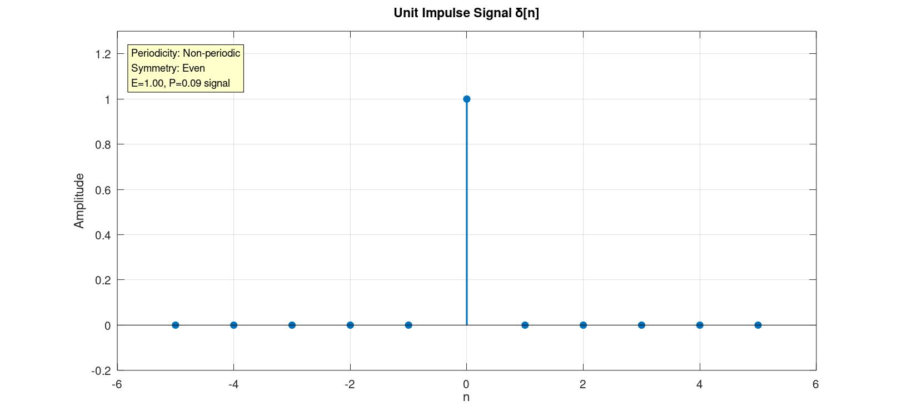
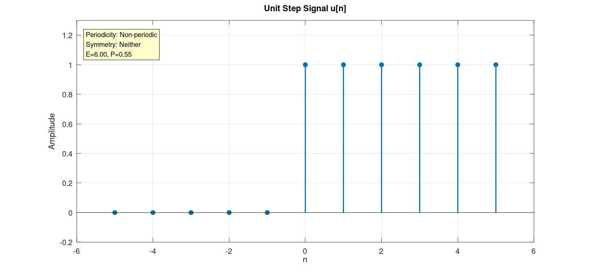
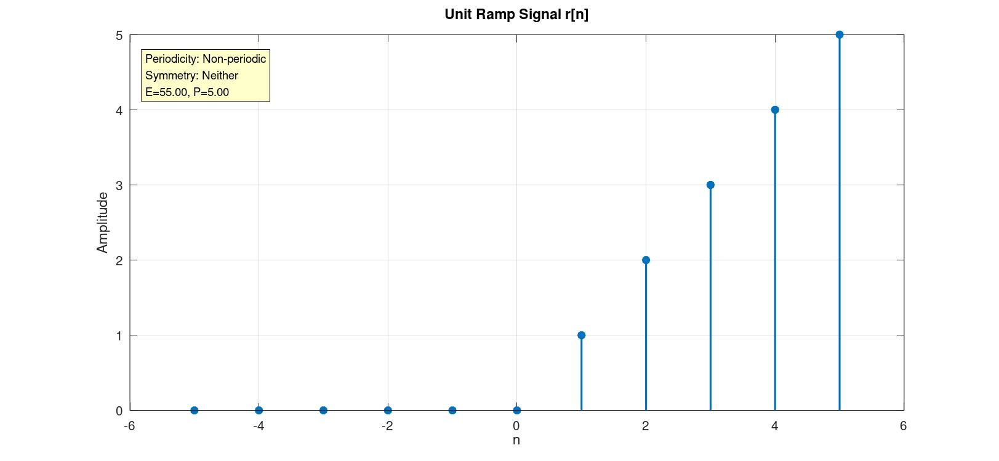
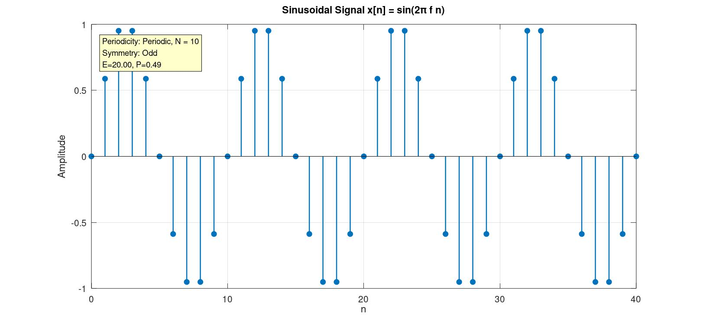
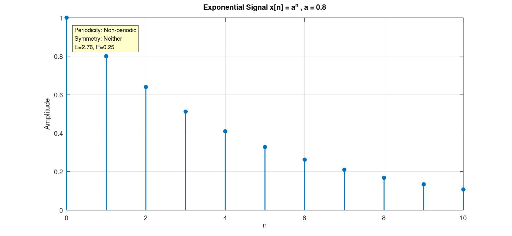

# Basic Discrete-Time Signals — Generation & Classification

A GNU Octave / MATLAB script that generates five fundamental discrete-time signals, classifies each one (periodicity, even/odd symmetry, and energy/power type), and plots the results with the classification printed directly on each graph.

## Overview

| | |
|---|---|
| **Script** | `Basic_DSP.m` |
| **Tool** | GNU Octave (MATLAB-compatible) |
| **Signals generated** | Unit Impulse, Unit Step, Unit Ramp, Sinusoidal, Exponential |
| **Analysis performed** | Periodicity check, Even/Odd/Neither classification, Energy/Power classification |
| **Output** | 5 annotated stem plots + a classification summary table in the console |

## How It Works

The script is organized into three stages:

1. **Signal Definitions** — each signal is generated over a chosen sample index range using vectorized logical/arithmetic expressions.
2. **Classification** — periodicity, symmetry, and energy/power type are computed programmatically *before* plotting, so the results can be embedded as on-graph labels.
3. **Plotting** — each signal is rendered with `stem()` and annotated with a text box summarizing its classification.

### 1. Signal Definitions

| Signal | Formula | Index Range | Parameters |
|---|---|---|---|
| Unit Impulse `δ[n]` | `x[n] = 1` if `n = 0`, else `0` | `n = -5:5` | — |
| Unit Step `u[n]` | `x[n] = 1` if `n ≥ 0`, else `0` | `n = -5:5` | — |
| Unit Ramp `r[n]` | `x[n] = n` if `n ≥ 0`, else `0` | `n = -5:5` | — |
| Sinusoidal | `x[n] = sin(2π f n)` | `n = 0:40` | `f = 0.1` |
| Exponential | `x[n] = aⁿ` | `n = 0:10` | `a = 0.8` |

### 2. Classification Logic

**Periodicity**
- Impulse, Step, and Ramp are hard-coded as **non-periodic** (true for their infinite-duration definitions).
- The sinusoid's frequency `f` is passed to `rat(f)` to recover it as a rational fraction `num/den`; if a valid denominator is found, the signal is periodic with fundamental period `N = den`.
- The exponential is periodic only in the trivial case `a = 1` (constant signal); otherwise non-periodic.

**Even / Odd / Neither**

Each signal is re-evaluated over a symmetric index range `nn = -10:10` (so reflection about `n = 0` is well-defined), then compared against its own time-reversed version `x[-n]` (`fliplr`):
- `x[n] == x[-n]` → **Even**
- `x[n] == -x[-n]` → **Odd**
- otherwise → **Neither**

**Energy / Power**

For each signal's originally-defined finite window, the script computes:

```
E = Σ |x[n]|²          (total energy)
P = E / N               (average power, N = number of samples)
```

If `E` is finite and `P → 0`, the signal is labeled an **energy signal** (`E = ...`); otherwise it is reported with both `E` and `P` values. Because the analysis is over a *finite, simulated window* rather than infinite duration, the script prints a note clarifying that:
- Over infinite duration, the **Step** signal is actually a **power signal**.
- Over infinite duration, the **Ramp** signal is **neither** an energy nor a power signal.

### 3. Plotting

Each of the 5 signals is drawn in its own figure using `stem(..., 'filled')`, with:
- A descriptive title and axis labels (`n` vs. `Amplitude`)
- Grid lines enabled
- A yellow annotation box (top-left corner) showing that signal's **Periodicity**, **Symmetry**, and **Energy/Power** classification, generated via `text(...)` with normalized axis coordinates

## Requirements

- [GNU Octave](https://www.gnu.org/software/octave/) (or MATLAB — the script uses only base functions: `stem`, `rat`, `fliplr`, `sprintf`, `printf`, `text`, all of which are compatible with both).
- No additional toolboxes required.

## Usage

```bash
octave Basic_DSP.m
```

or, from within MATLAB/Octave:

```matlab
run('Basic_DSP.m')
```

Running the script will:
1. Print a classification summary table to the console.
2. Open 5 figure windows, one per signal, each annotated with its classification.

### Console Output Example

```
================ SIGNAL CLASSIFICATION ================
Signal       Periodicity      Even/Odd   Energy/Power
Impulse      Non-periodic     Even       Energy (E=1.00)
Step         Non-periodic     Neither    E=6.00, P=0.55
Ramp         Non-periodic     Neither    E=55.00, P=5.00
Sine         Periodic, N = 10 Odd        E=20.00, P=0.49
Exponential  Non-periodic     Neither    E=2.76, P=0.25
=========================================================
Note: Step/Ramp classifications above are for the finite
simulated window. Over infinite duration, Step is a POWER
signal and Ramp is NEITHER energy nor power.
```

## Results

Each figure below shows the generated signal alongside its computed classification, exactly as produced by the script.

### 1. Unit Impulse Signal — `δ[n]`



A single non-zero sample at `n = 0`. Classified as **non-periodic**, **even** (symmetric about the origin), and an **energy signal** (`E = 1.00`), since its energy is finite and average power over the window is negligible.

### 2. Unit Step Signal — `u[n]`



Equals `1` for all `n ≥ 0`. Over the finite simulated window it comes out **non-periodic** and **neither** even nor odd, with `E = 6.00`, `P = 0.55`. (Over an infinite window, this becomes a true power signal.)

### 3. Unit Ramp Signal — `r[n]`



Increases linearly for `n ≥ 0`. Classified as **non-periodic** and **neither** even nor odd, with `E = 55.00`, `P = 5.00` over the finite window (neither an energy nor a power signal over infinite duration).

### 4. Sinusoidal Signal — `x[n] = sin(2πfn)`



With `f = 0.1`, `rat(f)` resolves the fundamental period to **N = 10**, so the signal is correctly identified as **periodic**. It is also **odd** (sine is an odd function) and comes out as an **energy-style** measure of `E = 20.00`, `P = 0.49` over the 41-sample window.

### 5. Exponential Signal — `x[n] = aⁿ, a = 0.8`



A decaying exponential (`0 < a < 1`). Classified as **non-periodic** and **neither** even nor odd, with `E = 2.76`, `P = 0.25` over the 11-sample window — consistent with a decaying sequence whose energy converges.

## Repository Structure

```
.
├── Basic_DSP.m              # Main Octave/MATLAB script
└── assets/
    ├── unit_impulse.jpg     # Output: Unit Impulse plot
    ├── unit_step.jpg        # Output: Unit Step plot
    ├── unit_ramp.jpg        # Output: Unit Ramp plot
    ├── sinusoidal.jpg       # Output: Sinusoidal plot
    └── exponential.jpg      # Output: Exponential plot
```

## Key Concepts Reference

| Concept | Definition |
|---|---|
| **Periodic signal** | `x[n] = x[n + N]` for some integer `N > 0` |
| **Even signal** | `x[n] = x[-n]` |
| **Odd signal** | `x[n] = -x[-n]` |
| **Energy signal** | Finite total energy `E`, zero average power (`P → 0`) |
| **Power signal** | Infinite energy, finite non-zero average power `P` |
